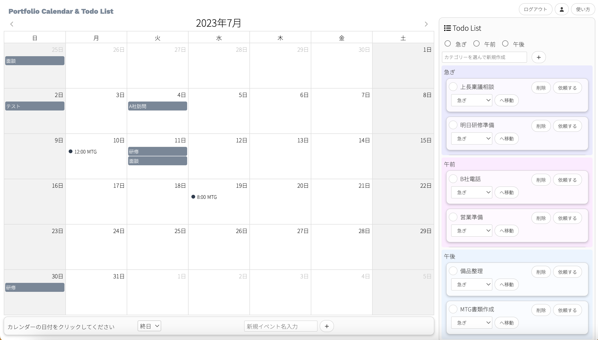

# Portfolio - Calendar & TodoList

URL:[Portfolio Calendar & Todo List](https://portfolio-calendar-9cb59.web.app/)


## アプリ紹介

カレンダーと Todo リストが同時に使えるアプリです。  
仕事中にはもってこいです。  
レスポンシブ対応してるので、スマホでも使用可能です。

**カレンダー**  
① 新規イベントを作成できる。  
(終日イベント・時間指定のあるイベント)  
② イベントをクリックするとポップアップで詳細が表示される。  
③ イベントを編集・削除できる。

**Todo リスト**<br>
① 新規 Todo を作成できる。  
(急ぎ・午前・午後　の３つのカテゴリーを選択できる。)  
②Todo のステータスを変更できる。  
(1)完了　チェックマーク  
完了した Todo にはチェックをつけることができる。  
(2)依頼ボタン  
誰かに依頼したけどリマインドとして、自分でも覚えておきたいときに押す。  
依頼した Todo は色が変化する。  
③ カテゴリー変更ができる。  
プルダウンで移動したいカテゴリーを選んで、移動ボタンを押す。  
④Todo を削除できる。

## 使用技術

・React 18.2.0  
・TypeScript 4.9.5  
・node-sass  
・@emotion/react 11.11.1  
・@fullcalendar/react 6.1.7  
・@supabase/supabase-js 2.26.0  
・firebase 10.0.0

## ファイル実行方法

```
git clone
npm start or yarn start
```

## このアプリを作ろうと思ったきっかけ

事務職で働いていた時、卓上カレンダーと付箋で仕事を管理していました。  
資料の入ったファイルや PC のキーボード、書類をたくさん机に置いていたため、繁忙期は机の上が物で溢れかえっていました。  
上司から頼まれた仕事を付箋にメモしても、どこかへ消えてしまいます。  
電話でお客さんからの納期変更も、卓上カレンダーだと落ち着いて書かないと綺麗に書けません。  
これらを解決すべく、カレンダーと Todo リストを合体させたアプリを作成してみました。  
数年前の自分にこのアプリをプレゼントしたいです。
